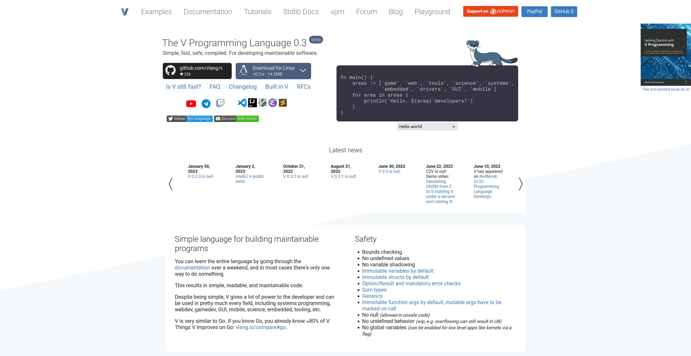

# vlanghugo
2nd fork of The V Programming Language Website. i decided that the npm version is unneccessary and complex as the only JS that has to be used is to give a proper downlaod link depending on user's OS so i moved everything to Hugo.

https://vlang.io

\
[The original version](https://github.com/hex2f/vlang.io) was written by [leahlundqvist](https://github.com/hex2f) aka ``hex2f``.

## How To Contribute

There are various way you can contribute to this project. Refactoring writings, updating css, adding language support etc. We will cover them one by one.

### Styling the website

There is `app.css` file in ``assets/css`` folder  which is the main stylesheet. It is converted from `app.sass` file. Use `index.html` in ``public`` folder to view the rendered html file. This will help you style the website.

### Adding Language

tbd, see `i18n` folder

### Building

The website is built via Hugo. now i use `hugo v0.111.3`

To build:
```
git clone https://github.com/t4wE/vlanghugo
cd vlanghugo
sassc assets/css/sass/style.sass > assets/css/style.css
hugo
hugo server
```
